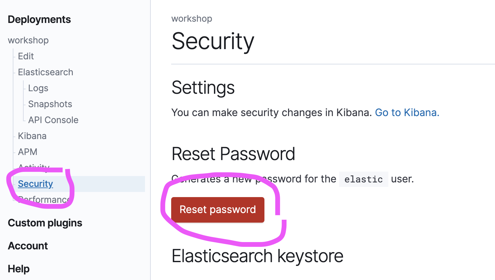

# Create an Account

If you already have an Elastic Cloud account, [head on over and sign in](https://cloud.elastic.co).

If you've never used Elastic Cloud before, you'll need to make an account. Head over to
[Elastic Cloud](http://elastic.co/cloud/elasticsearch-service/signup) and sign up.

#### 1. Enter your email 
We'll need this to start your trial. Write down the email you used in case you need it later
to log back in after a break.

#### 2. Click the blue button in the email
It might take a few seconds to arrive.

#### 3. Choose a password. 
Write this down in case you're logged out for inactivity during a break.

#### 4. Create your trial deployment
You're now signed into the "command and control" center, and now you can create your trial 
deployment.

#### 5. Name the deployment
Naming it `workshop` helps us with our record-keeping :).

#### 6. Choose your favorite cloud provider and region. 
This is where your deployment will be hosted by Elastic for 14 days. There's no practical
difference between them. Most people choose a cloud provider based on where the rest of their
environment is hosted to reduce avoid network charges. Choosing a region geographically close
to you will make response times faster.

#### 7. Choose your software version
This workshop is designed for use with 7.6.

#### 8. Click `Create deployment`!
If you're working fast, feel free to click `Customize deployment` instead. In a  non-trial scenario,
this is where you would go to choose the size of your Elasticsearch, Kibana, App Search, and
APM resources.

#### 9. Capture your credentials.
Your deployment should take 1-3 minutes to spin up. While the Clouds are working, copy your
Elasticsearch/Kibana credentials into a text file. Or just use the `DOWNLOAD` button!

This is the only time you'll see this password. If anything goes wrong, you can reset your
password here:

#### 10. Note your endpoints.
Elastic Cloud stood up a bunch of infrastructure for you. You'll need to refer to your endpoints
and Cloud ID later. These are available whenever you need them. You can find them here:

#### 11. Launch Kibana!

#### 12. Log in to Kibana
Use the `elastic` username and password you were provided a moment ago.

#### 13. Kibana will ask if you  want to load sample data.
Let's do it.

#### 14. Add the samples

#### 15. Turn on monitoring
If you want to see how data is organized, how big it is, and understand the performance impact
of your usage... this is the place to be! It'll take 5-10 seconds to get going.
